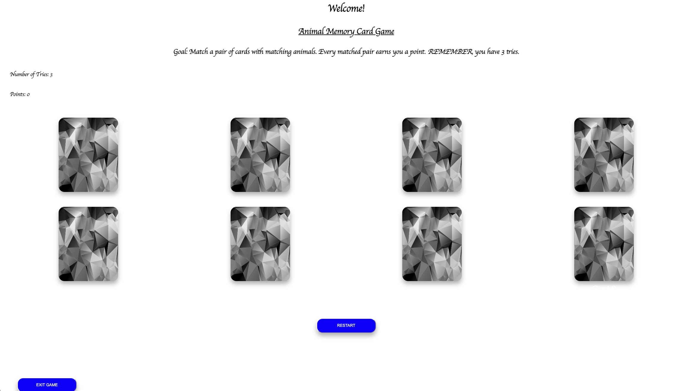
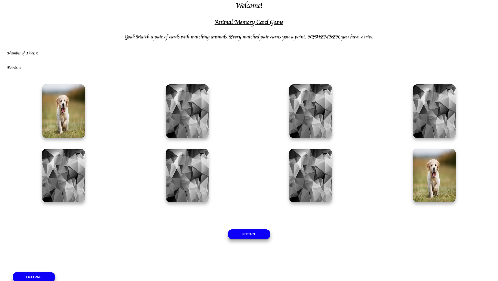

# Animal Memory Card Game

The memory card game is a game with 4 different sets of identical cards with photos of animals. The goal is to match a pair of cards until all are matched up. You as the player can earn points for every matched pair. Once all pairs are matched, you win the game. 

# Screenshots of Game

# Technologies Used

- HTML
- CSS (Cascading Style Sheets)
- Javascript

# Getting Started

<a href="https://christianzem.github.io/Project1/">Click me to play the game</a>

# Next Steps

- Implement three different game modes (easy, moderate, hard). 
- Include an animation to the flipping of the cards. 

